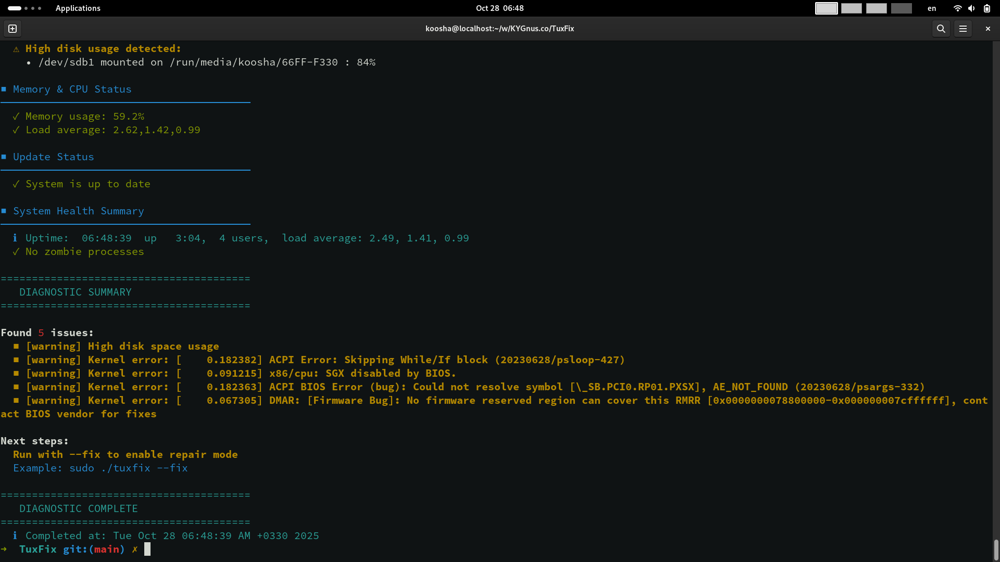

# TuxFix - Linux System Diagnostic & Repair Tool



A comprehensive, user-friendly Linux system diagnostic and automated repair tool designed for both beginners and system administrators. TuxFix performs thorough system health checks and provides interactive repair options for common Linux issues.

## 🚀 Features

### 🔍 Comprehensive System Diagnostics
- **Kernel Health**: Detects kernel errors, firmware issues, and hardware compatibility problems
- **Service Status**: Monitors critical services (SSH, Cron, Systemd, etc.)
- **Network Connectivity**: Checks DNS resolution, internet connectivity, and network interfaces
- **Security Assessment**: Verifies SSH permissions, system updates, and security configurations
- **Disk Usage**: Monitors disk space and identifies storage issues
- **Memory & CPU**: Tracks memory usage, load averages, and system performance
- **System Updates**: Checks for available package updates

### 🛠️ Smart Repair System
- **Interactive Repair**: Ask for confirmation before applying each fix
- **Automatic Repair**: Batch repair all detected issues
- **Safe Operations**: Non-destructive fixes with user confirmation
- **Color-coded Output**: Visual indicators for issue severity
- **Human-readable Reports**: Clear, formatted output for easy understanding

### 🎯 Supported Distributions
- **Debian/Ubuntu** (apt-based)
- **Fedora/RHEL/CentOS** (dnf-based)  
- **openSUSE/SUSE** (zypper-based)

## 📦 Installation

### Quick Install
```bash
# Make it executable
chmod +x tuxfix

# Run with basic checks
sudo ./tuxfix
```

### Manual Installation
```bash
git clone https://github.com/KYGnus/TuxFix.git
cd tuxfix
chmod +x tuxfix
sudo ./tuxfix
```

## 🎮 Usage

### Basic Health Check (Read-only)
```bash
sudo ./tuxfix
```
*Performs all checks without making any changes*

### Interactive Repair Mode
```bash
sudo ./tuxfix --fix
```
*Shows repair menu and asks for confirmation for each fix*

### Verbose Mode (Debugging)
```bash
sudo ./tuxfix --verbose
```
*Shows detailed command execution for debugging*

### Email Reports
```bash
sudo ./tuxfix --email admin@company.com
```
*Sends diagnostic report via email*

### Combined Options
```bash
sudo ./tuxfix --fix --verbose --email admin@company.com
```

## 📋 What TuxFix Checks

### 1. Kernel & Hardware
- Kernel errors and warnings from dmesg
- Firmware/BIOS compatibility issues
- Hardware detection problems

### 2. Services & Daemons
- Failed system services
- Critical service status (SSH, Cron, logging)
- Service dependency issues

### 3. Network & Connectivity
- DNS resolution capabilities
- Internet connectivity
- Network interface status
- Firewall configurations

### 4. Security
- SSH configuration permissions
- System update availability
- Security best practices

### 5. Storage & Performance
- Disk usage and capacity planning
- Memory utilization
- CPU load averages
- Zombie process detection

### 6. System Updates
- Available package updates
- Repository health
- Update manager status

## 🛠️ Repair Capabilities

### Service Management
- Restart failed services
- Enable and start critical services
- Reset service failure counters

### Security Fixes
- Fix insecure file permissions
- Apply security updates
- Configure proper SSH settings

### System Maintenance
- Clear temporary files
- Free memory caches
- Clean up zombie processes
- Fix DNS configuration

### Network Repair
- Restart network services
- Configure DNS resolvers
- Enable firewall protection

## 🎪 Interactive Repair Menu

When you run `./tuxfix --fix`, you'll see:

```
ISSUES FOUND - REPAIR MENU
Found 6 issues that may need attention:

1. [security] Insecure SSH config permissions: 640
2. [warning] High disk space usage: 84%
3. [warning] Kernel error: DMAR firmware issue
4. [warning] Kernel error: ACPI BIOS Error
...

Repair Options:
  [A] Repair All issues automatically
  [I] Interactive repair (ask for each issue)
  [S] Show issues only (no repair)
  [Q] Quit without repair

Choose option (A/I/S/Q):
```

### Repair Options Explained

- **A**: Automatically repair all detected issues
- **I**: Interactive mode - confirm each repair individually  
- **S**: Show issues only, no repairs performed
- **Q**: Quit without making any changes

## 🎨 Color-coded Output

TuxFix uses color coding to indicate issue severity:

- 🔴 **RED**: Critical issues requiring immediate attention
- 🟡 **YELLOW**: Warnings that should be addressed
- 🔵 **BLUE**: Informational messages and network-related issues
- 🟢 **GREEN**: Success messages and healthy system status

## 📊 Sample Output

### Diagnostic Run
```
========================================
   Linux System Diagnostic & Repair Tool
========================================
  ℹ Started at: Tue Oct 28 06:20:04 AM +0330 2025
  ℹ Fix mode: Disabled

■ Detecting System Distribution
────────────────────────────────────────
  ✓ Detected: openSUSE Leap 15.6
  ℹ Package Manager: zypper

■ Kernel Health Check
────────────────────────────────────────
  ⚠ Found kernel errors:
    • [Firmware Bug]: No firmware reserved region...
    • x86/cpu: SGX disabled by BIOS.

■ Services Status Check
────────────────────────────────────────
  ✓ No failed services found
  ✓ sshd: active
  ✓ cron: active

■ Security Assessment
────────────────────────────────────────
  ✓ System is up to date
  ⚠ SSH config permissions are insecure: 640

========================================
   DIAGNOSTIC SUMMARY
========================================

Found 6 issues:
  ■ [security] Insecure SSH config permissions: 640
  ■ [warning] High disk space usage
  ■ [warning] Kernel error: [Firmware Bug]...
  ■ [warning] Kernel error: x86/cpu: SGX disabled by BIOS.
  ■ [warning] Kernel error: ACPI BIOS Error...
  ■ [warning] Kernel error: ACPI Error...

Next steps:
  Run with --fix to enable repair mode
  Example: sudo ./tuxfix --fix
```

## 🔧 Advanced Usage

### Cron Job for Regular Monitoring
```bash
# Add to crontab for daily health checks
sudo crontab -e

# Run daily at 2 AM and email report
0 2 * * * /path/to/tuxfix --email admin@company.com

# Run weekly with auto-fix for maintenance
0 3 * * 0 /path/to/tuxfix --fix
```

### Integration with Monitoring Systems
```bash
# Check exit status for monitoring integration
sudo ./tuxfix
EXIT_CODE=$?

if [ $EXIT_CODE -eq 0 ]; then
    echo "System healthy"
else
    echo "System issues detected"
    # Trigger alerts or notifications
fi
```

### Custom Checks (Extending TuxFix)
You can extend TuxFix by adding custom check functions:

```bash
# Add to the script before main() function
check_custom_services() {
    print_section "Custom Services Check"
    
    # Your custom checks here
    if ! systemctl is-active custom-service &>/dev/null; then
        print_warning "Custom service not running"
        add_issue "custom_service" \
            "Custom service is down" \
            "systemctl start custom-service" \
            "service"
    fi
}

# Call it in main() function
check_custom_services
```

## 🛡️ Safety Features

- **Non-destructive**: Most checks are read-only by default
- **Confirmation Required**: Asks for user confirmation before repairs
- **Backup Creation**: Critical configurations are backed up before changes
- **Rollback Capability**: Some fixes include rollback options
- **Root Privilege Check**: Warns if running without sufficient permissions

## 🐛 Troubleshooting

### Common Issues

**Script won't run:**
```bash
# Ensure executable permissions
chmod +x tuxfix

# Check bash version (requires 4.0+)
bash --version
```

**Missing dependencies:**
```bash
# On Debian/Ubuntu
sudo apt update && sudo apt install coreutils procps systemd

# On Fedora/RHEL
sudo dnf install coreutils procps-ng systemd

# On openSUSE
sudo zypper install coreutils procps systemd
```

**Permission errors:**
```bash
# Run with sudo
sudo ./tuxfix

# Or run as root
su -c "./tuxfix"
```

### Debug Mode
For detailed debugging information:
```bash
sudo ./tuxfix --verbose
```


## 📄 License

This project is licensed under the MIT License - see the [LICENSE](LICENSE) file for details.

## 🙏 Acknowledgments

- Linux community for best practices and inspiration
- Contributors who help improve TuxFix
- Testers across various Linux distributions

## 📞 Support

- 📧 Email: kygnus.co@proton.me
- 📚 website: [Wiki](https://kygnus.girhub.io)

---

**TuxFix** - Keeping your Linux systems healthy and secure! 🐧✨
